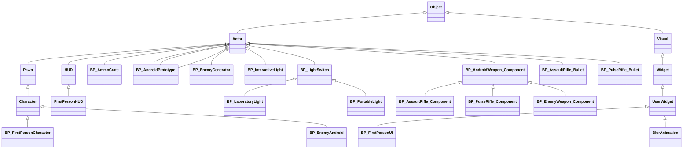

# DEV23-HernandezMartinez

# Desarrollo de Videojuegos - Práctica Final

Este proyecto corresponde a la práctica final de la asignatura Desarrollo de Videojuegos del máster en Ingeniería Informática. La práctica consiste en un Third Person Shooter con elementos tácticos, interactuación con objetos y HUD. En un mundo dominado por una maligna empresa de androides, nuestro protagonista robot es el único capaz de frenar una nueva amenaza para la humanidad: el último modelo de soldado androide gigante. Colándose en la sala de investigación de la base de operaciones de la corporación, debe eliminar al nuevo androide con el fin de prevenir un nuevo desastre. El juego fue creado por Daniel Hernández Martínez. Parte de la base de la tercera práctica de la asignatura, ofreciendo cambios y añadidos a la misma. El objetivo es centrar el juego en el sigilo, penalizando el uso de la fuerza bruta y forzando al jugador a idear una táctica antes de avanzar por el nivel. Par ello, el protagonista cuenta con una serie de poderes que le serán de gran ayuda para pasar desapercibido. Además se centra también en la implementación y uso de animaciones. El proyecto cuenta con un vídeo explicativo con el resultado final del juego que complementa esta documentación: [Demo final]()

## Instalación y uso
Para poder ejecutar el proyecto se debe descargar este repositorio y añadir a la carpeta Content las carpetas que aparecen en el siguiente enlace de Google drive: [Contenido extra]().

El juego se puede ejecutar tanto en Unreal Engine como mediante el ejecutable publicado en releases.

## Preproducción
El diseño del juego debe aplicar los conocimientos adquiridos durante la asignatura de Desarrollo de Videojuegos. Para crear la documentación se ha usado como ayuda la documentación del siguiente repositorio: https://github.com/Narratech/DEV-P0 y las prácticas 1 (https://github.com/DEV23-G05/DEV23-G05-P1), 2 (https://github.com/DEV23-G05/DEV23-G05-P2) y 3 (https://github.com/DEV23-G05/DEV23-G05-P3) de la asignatura. Para realizar el juego se parte de la plantilla de Unreal Engine [Third Person Template](https://docs.unrealengine.com/5.2/en-US/third-person-template-in-unreal-engine/).

El diseño cuenta con estas secciones:
- [Estética](#Estética)
  * [Gráficos](#Gráficos)
  * [Sonidos](#Sonidos)
- [Dinámica](#Dinámica)
  * [Objetivo](#Objetivo)
  * [Castigo](#Derrota)
- [Contenido](#Contenido)
  * [Protagonista](#Protagonista)
  * [Armas](#Armas)
  * [Enemigos](#Enemigos)
  * [Cabinas generadoras](#Cabinas)
  * [Pasillos](#Pasillos)
  * [Puertas](#Puertas)
  * [Luces](#Luces)
  * [Gafas de visión nocturna](#Gafas)
  * [Prototipo de androide](#Prototipo)
  * [HUD](#HUD)
- [Salas](#Salas)
- [Niveles de dificultad](#Niveles)

### Estética
Para realizar el juego se ha utilizado una estética futurista, ambientada en un laboratorio de investigación de androides donde trascurre la acción. Para llevar a cabo el proyecto se utiliza el contenido de la plantilla First Person, el Starter Content, la biblioteca Megascans, [Animation Starter Pack](https://www.unrealengine.com/marketplace/en-US/product/animation-starter-pack), [Modular SciFi Season 1 Starter Bundle](https://www.unrealengine.com/marketplace/en-US/product/modular-scifi-season-1-starter-bundle), [Modular Scifi Season 2 Starter Bundle](https://www.unrealengine.com/marketplace/en-US/product/modular-scifi-season-2-starter-bundle), [Infinity Blade: Effects](https://www.unrealengine.com/marketplace/en-US/product/infinity-blade-effects?sessionInvalidated=true) y [FPS Weapon Bundle](https://www.unrealengine.com/marketplace/en-US/product/fps-weapon-bundle). Estos últimos 5 contenidos se pueden encontrar gratuitamente en la tienda de Unreal Engine. Junto a estos elementos, puede aparecer contenido descargado de Internet y que sea ajeno a las fuentes definidas previamente. Este puede ser el caso de ciertos modelos o efectos de sonido. Todo este contenido se encontrará en la carpeta compartida en Google Drive. 

#### Gráficos
Como la estética será futurista, todo el contenido gráfico será fiel a esta estética. Esto creará un mundo coherente en el que no aparezcan elementos que desentonen con el resto.

#### Sonidos
El juego no cuenta con sonido ambiente ni banda sonora, pero cuenta con varios efectos de sonido:
- **Disparo:** Se reproduce cuando el personaje o los enemigos disparan. El sonido es distinto para cada tipo de arma.
- **Sin munición:** Sonido que produce el cerrojo del fusil de asalto al intentar disparar sin munición.
- **Daño:**: Se reproduce cuando el personaje recibe daño.
- **Muerte**: Se reproduce cuando el personaje muere.
- **Pasos** Sonido que se produce al andar sin ir agachado. Está coordinado con cada paso que da el personaje.
- **Gafas de visión nocturna:**: Se activa al ponerse o quitarse la gafas de visión nocturna.
- **Distracción**: Sonido que se reproduce en el lugar objetivo cuando el jugador utiliza el poder de distracción.
- **Granada:** Sonido que se escucha al detonar una granada de fragmentación.

#### Iluminación
El juego transcurre de noche, con muy escasa iluminación natural. Tanto en las zonas interiores como exteriores, hay una serie de luces que iluminan el escenario. Estas luces pueden ser encendidas y apagadas con un interruptor. Esta iluminación, además de permitir al jugador observar mejor el entorno, influye en la jugabilidad. En caso de que el jugador se encuentre en una zona iluminada, le será más fácil a los enemigos poder detectar y disparar al jugador. Debido a ello, encontrar los interruptores que apagan las luces es una buena idea para completar la zona. Pero apagar las luces elimina prácticamente la totalidad de la iluminación, haciendo muy difícil al jugador poder avanzar por el nivel. Para ello, el protagonista cuenta con unas gafas de visión nocturna, las cuales le permiten poder ver en la oscuridad.

#### Interfaz virtual
Nuestro protagonista, al ser un androide, cuenta con una serie de información que puede observar como realidad aumentada ante sus ojos. Esta interfaz es el HUD del juego, que cuenta con una serie de información, como balas restantes o salud, que se comentará más adelante en la sección de [HUD](#HUD).

### Dinámica
La dinámica del juego consiste en recorrer unas instalaciones repletas de enemigos hasta llegar al final. A lo largo del escenario aparecen una serie de objetos con los que el personaje puede interactuar, como interruptores de luz o recargas de munición. El juego cuenta con dos niveles. Siguiendo ambos la misma estructura. Cuando el jugador llegue a la zona final del segundo nivel, se encontrará con un enemigo final: el androide soldado gigante.

#### Objetivo
El objetivo final es destruir el prototipo de androide soldado gigante, para frenar una posible guerra entre robots y humanos.

#### Castigo
El jugador puede recibir daño al recibir disparos. Si su salud llega a cero, el jugador muere, volviendo al último punto de control. 

#### Conflictos
A lo largo del nivel, el jugador se encontrará con una serie de androides enemigos que patrullarán la zona. En caso de que el jugador sea detectado por estos, intentarán acabar con su vida mediante el uso de armas de fuego. La mejor estrategia para acabar con los enemigos es utilizar el sigilo, ya que en caso de comenzar un intercambio de disparos, lo más probable es terminar muerto. Para completar estas zonas sigilosamente contarás con el uso un rifle de asalto, un fusil de pulsos, una serie de poderes y elementos interactivos como son los interruptores o los objetos destruibles. 

#### Recompensas
El jugador cuenta con una serie de recompensas a lo largo de los niveles. Estas son dos:

- **Cajas de munición:** Permiten al jugador obtener más munición para el rifle de asalto.

- **Interruptores:** Permiten al jugador activar o desactivar las luces a su antojo para poder obtener una ventaja táctica sobre sus enemigos. 

- **Objetos interactivos:** Permiten al jugador interactuar con ellos mediante su poder de telequinesis.

#### Mecánicas
El jugador cuenta con una serie de mecánicas que le permiten interactuar con el entorno:

- **Movimiento:** El jugador puede moverse por el escenario utilizando el esquema de teclas "WASD".

- **Salto:** El jugador puede realizar un salto al pulsar la barra espaciadora.

- **Agacharse:** Permite al jugador agacharse para andar sin hacer ruido al pulsar la tecla "C".

- **Disparo:** El jugador puede disparar tanto su fusil de asalto como su fusil de pulsos presionando el click izquierdo del ratón. Ambas armas son automáticas, por lo que mantener el click pulsado permite al jugador disparar en modo "full auto". En caso del fusil de asalto, solo podrá disparar si tiene munición disponible.

- **Apuntar:** El jugador puede apuntar con su arma mediante el uso del click derecho del ratón.

- **Cambio de arma:** El jugador puede cambiar entre el fusil de asalto y el fusil de pulsos con las teclas 1 y 2. 
	- **Tecla 1:** Equipa con el fusil de asalto.
	-  **Tecla 2:** Equipa el fusil de pulsos

- **Ejecución:** El jugador puede ejecutar sigilosamente a los enemigos por la espalda.

- **Lanzar granada:** El jugador puede lanzar una granada que elimine a los enemigos cercanos al presionar la tecla "G".

- **Interactuar:** El jugador puede interactuar con distintos elementos del entorno al presionar la tecla "E" mientras los mire y está a su alcance. En esta práctica, el jugador puede interactuar con dos elementos:
	- **Cajas de munición:** Permiten al jugador obtener más balas del fusil de asalto.
	- **Interruptores:** Permiten al jugador encender o apagar las luces de la sala.

- **Gafas de visión nocturna:** El jugador puede pulsar la tecla "X" para equiparse o desequiparse las gafas de visión nocturna, las cuales le permiten observar su entorno en condiciones de poca iluminación.

- **Poderes:** El jugador cuenta con una serie de poderes que le permiten interactuar con el entorno. Se activan con la tecla "Q".

- **Cambio de poder:** El jugador puede cambiar entre los poderes activos al pulsar las siguientes teclas. 
	- **Tecla 3:** Equipa el poder de la invisibilidad.
	- **Tecla 4:** Equipa el poder de la distracción.
	- **Tecla 5:** Equipa el poder de la telequinesis.
	- **Tecla 6:** Equipa el poder del silencio.

### Contenido
En esta sección se hablará del contenido más relevante del juego.

#### Protagonista

El avatar que utiliza el juego es el maniquí por defecto de Unreal Engine. Este avatar cumple con la estética del juego, ya que es un androide. El jugador controla al personaje con las teclas expuestas en el apartado anterior. El jugador puede morir si su vida llega a cero. La salud del jugador es de 100 puntos y, en caso de recibir daño, se restablece tras unos segundos fuera de combate. Una parte muy importante del protagonista son las animaciones. Este cuenta con animaciones especificas y detalladas para las distintas acciones. Estas son sacadas de la plantilla [Lyra Sample Game](https://docs.unrealengine.com/5.3/en-US/lyra-sample-game-in-unreal-engine/), pero ha sido creado un Animation Blueprint desde cero, implementando elementos avanzados como la división del cuerpo en parte superior e inferior para reproducir distintas animaciones o la implementación de Animation Offset para el apuntado.

#### Armas

El jugador cuenta con dos armas que puede intercambiar con los botones del teclado 1 y 2. Ambas se disparan con el click izquierdo. Las dos armas que existen son las siguientes:
- **Fusil de asalto**: Arma de fuego que dispara balas que dañan a los enemigos. Emite ruido al dispararse. Su munición se puede agotar, pero puedes obtener más de las cajas de munición.
- **Fusil de pulsos**: Arma de plasma que emite esferas de energía. Las esferas aturden a los enemigos durante un tiempo, tras el cual vuelven a su estado original. El sonido emitido por este arma es muy bajo para ser escuchado por los enemigos. Tiene munición infinita, pero cuenta con un tiempo entre disparos de 1 segundo y una caída muy elevada del proyectil.

#### Poderes

El jugador cuenta con una serie de poderes que le permiten interactuar con el entorno. Se cambia entre poderes con la tecla correspondiente de cada uno y se lanzan con la tecla "Q". Todos tienen un tiempo de enfriamiento entre usos, distinto para cada poder. Los poderes son los siguientes:
- **Invisibilidad:** Permiten al jugador volverse invisible durante 5 segundos, evitando ser detectado por los enemigos. Si efectúa una acción que emite un sonido, este puede seguir siendo escuchado por los enemigos.
- **Distracción:** El jugador emite un sonido en el lugar que esté apuntando con la mira, haciendo que los enemigos cercanos vayan a investigarlo.
- **Telequinesis:** Permite al jugador interactuar con ciertos elementos interactivos del escenario. Esto le permite, por ejemplo, tirar obstáculos sobre los enemigos para eliminarlos sigilosamente.
- **Silencio:** Permite al jugador andar sin hacer ruido durante 5 segundos sin la necesidad de estar agachado. Además, durante este tiempo, pude disparar el fusil una vez sin hacer ruido. Pero debido al esfuerzo que supone suprimir un sonido tan alto, tras disparar la primera bala, el efecto se desactiva.

#### Granadas

El jugador puede utilizar granadas para eliminar a los enemigos que se encuentren en sus proximidades. La explosión emite un ruido que pueden escuchar los enemigos cercanos.

#### Enemigos

En el escenario hay una serie de androides enemigos patrullando las salas. Estos cuentan con un comportamiento inteligente. Por defecto, patrullan por las salas siguiendo un camino preestablecido. Los enemigos cuentan con una serie de coordenadas que recorren en orden. Existen dos tipos de patrullaje que pueden adoptar los enemigos. Para ilustrar un ejemplo, supondremos que el enemigo tiene establecida la siguiente ruta de puntos por los que tiene que pasar: A, B, C, D.

- **Patrullaje circular:** El enemigo volverá al primer punto de patrullaje tras llegar al último. De esta forma se crea un ciclo de recorrido circular. El recorrido que hará será el siguiente: A, B, C, D,  A, B, C, D,  A, B, C, D...

- **Patrullaje con retorno:** El enemigo volverá al punto de patrullaje anterior tras llegar al último, recorriendo de nuevo el camino al revés. Lo mismo sucederá cuando vuelva al primer punto. El recorrido que hará será el siguiente: A, B, C, D, C, B, A, B, C, D, C, B, A...

De esta forma, los enemigos no se moverán de manera aleatoria, si no que seguirán caminos fijos que permitirán al jugador idear estrategias para eliminarlos o evitarlos. Si el jugador entra en su campo visual, comienzan a dispararle. El jugador puede ayudarse de zonas oscuras para evitar ser visto. En caso de oír un sonido, los enemigos irán a su localización para investigarlo. Pasado un tiempo, si no detectan al jugador u oyen un nuevo ruido, continúan con su patrullaje, volviendo a su camino preestablecido. El esquema de su comportamiento es el siguiente, teniendo más prioridad las acciones cuanto más a la izquierda del esquema estén:

Los enemigos mueren de varios disparos en el cuerpo y no pueden regeneran salud fuera de combate. Mueren de un solo disparo a la cabeza.

#### Prototipo de androide soldado gigante

Prototipo de androide que se encuentra en la sala final. Es el jefe final del juego, el cual termina al derrotarlo. El androide no puede andar, ya que todavía no se encuentra en pleno funcionamiento. Aún así, tiene capacidades especiales y puede detectar al jugador fácilmente. Su ponente fusil mata al protagonista de un solo disparo. Es inmune a las balas, por lo que el jugador debe acercarse a él sigilosamente, haciendo uso de sus poderes y de los elementos del escenario para llegar a su espalda y atacarle en su único punto débil. 

#### Pasillos

Separan las distintas salas del juego. Se acceden y abandonan mediante puertas automáticas.

#### Puertas

Puertas que separan las salas de los pasillos. Se abren y cierran al acercarse a ellas.

#### Luces

Luces que aparecen repartidas por las salas. Se pueden encender y apagar pulsando un interruptor.

#### Gafas de visión nocturna

Permiten al jugador ver en la oscuridad.

#### Munición 

Cuando el jugador interactúa con este objeto, obtiene munición para el fusil de asalto.

#### Puntos de control

Puntos de control sobre los que reaparece el jugador al morir si han sido activados.

#### Elementos interactivos

Elementos que aparecen por el escenario con los que el jugador puede utilizar su poder de telequinesis. Al hacerlo, estos se destruirán, haciendo caer los pesados objetos situados sobre ellos, los cuales pueden acabar con los enemigos que golpeen.

#### HUD

El juego cuenta con un HUD en el que se muestra la siguiente información:

- **Salud**: Salud actual del jugador representada mediante una barra.

- **Arma equipada**: Imagen del arma que tiene equipada el jugador.

- **Munición disponible**: Número de balas disponibles para el arma equipada.

- **Poder activo**: Indica mediante una imagen el poder activo.

### Escenario

El juego está dividido en dos niveles, los cuales cuentan con diversas salas llenas de enemigos. Se cambia entre un nivel y otro al llegar a la puerta final del nivel. Estas salas cuentan con todos los elementos descritos anteriormente. Al final del último nivel se encuentra la sala del jefe final.

A continuación se muestran imágenes cenitales del escenario:

Introducir imágenes

## Producción

A lo largo del desarrollo se han realizado las siguientes tareas:
| Estado  |  Tarea 
|:-:|:--|
| ✓ | Diseño: Primer borrador 
| ✓ | Mecánica: Fusil de asalto
| ✓ | Mecánica: Fusil de pulsos
| ✓ | Mecánica: Munición
| ✓ | Mecánica: Luces
| ✓ | Mecánica: Puertas
| ✓ | Mecánica: Enemigos
| ✓ | Mecánica: Gafas de visión nocturna
| ✓ | Mecánica: Animaciones
| ✓ | Mecánica: Ejecuciones
| ✓ | Mecánica: Patrullaje
| ✓ | Mecánica: Invisibilidad
| ✓ | Mecánica: Distracción
| ✓ | Mecánica: Telequinesis
| ✓ | Mecánica: Headshot
| ✓ | Mecánica: Sonido de los pasos
|  | Mecánica: Granada
|  | Mecánica: Jefe final
|  | Diseño: Primer nivel
|  | Diseño: Segundo nivel
|  | Diseño: Sala final

Lista de mecánicas implementadas:
- [x] Mecánica: Fusil de asalto
- [x] Mecánica: Fusil de pulsos
- [x] Mecánica: Munición
- [x] Mecánica: Luces
- [x] Mecánica: Puertas
- [x] Mecánica: Enemigos
- [x] Mecánica: Gafas de visión nocturna
- [x] Mecánica: Animaciones
- [x] Mecánica: Ejecuciones
- [x] Mecánica: Patrullaje
- [x] Mecánica: Invisibilidad
- [x] Mecánica: Distracción
- [x] Mecánica: Telequinesis
- [x] Mecánica: Headshot
- [x] Mecánica: Sonido de los pasos
- [ ] Mecánica: Granada
- [ ] Mecánica: Jefe final

Las clases principales que se desarrollarán son las siguientes: (Definir cuando el juego esté terminado)

## Posproducción

Como posproducción se realizará un pulido final del juego. Se generará un ejecutable, el cual será subido al apartado de releases del repositorio. Además se generará un vídeo en el que se explique el comportamiento del juego: [Demo Práctica Final]()

## Licencia

Daniel Hernández Martínez, autor de la documentación, código y recursos de este trabajo, concedo permiso permanente a los profesores de la Facultad de Informática de la Universidad Complutense de Madrid para utilizar mi material, con sus comentarios y evaluaciones, con fines educativos o de investigación; ya sea para obtener datos agregados de forma anónima como para utilizarlo total o parcialmente reconociendo expresamente mi autoría.

Una vez superada con éxito la asignatura se prevee publicar todo en abierto (la documentación con licencia Creative Commons Attribution 4.0 International (CC BY 4.0) y el código con licencia GNU Lesser General Public License 3.0).

## Referencias

Inspiración a la hora de crear el juego:
- **Metal Gear Solid V: The Phantom Pain**, Konami. Inspiración en el sigilo.
- **Saga Metro**. Inspiración en el sistema de detección de zonas de luz y oscuridad y en poder apagar y encender las luces.
- **The Last of Us**, Naughty Dog. Inspiración en poder pasar los niveles sigilosamente sin necesidad de acabar con los enemigos.
- **Splinter Cell**, Ubisoft. Inspiración en el uso de las gafas de visión nocturna para ver en la oscuridad.
- **Yo robot**. Inspiración de la estética y mundo.

Plantilla de Unreal Engine utilizada: [First Person Template](https://docs.unrealengine.com/5.2/en-US/first-person-template-in-unreal-engine/)

Contenido utilizado:
[Animation Starter Pack](https://www.unrealengine.com/marketplace/en-US/product/animation-starter-pack)
[Modular SciFi Season 1 Starter Bundle](https://www.unrealengine.com/marketplace/en-US/product/modular-scifi-season-1-starter-bundle)
[Modular Scifi Season 2 Starter Bundle](https://www.unrealengine.com/marketplace/en-US/product/modular-scifi-season-2-starter-bundle)
[Infinity Blade: Effects](https://www.unrealengine.com/marketplace/en-US/product/infinity-blade-effects?sessionInvalidated=true)
[FPS Weapon Bundle](https://www.unrealengine.com/marketplace/en-US/product/fps-weapon-bundle)

[Lyra Sample Game](https://docs.unrealengine.com/5.3/en-US/lyra-sample-game-in-unreal-engine/)

